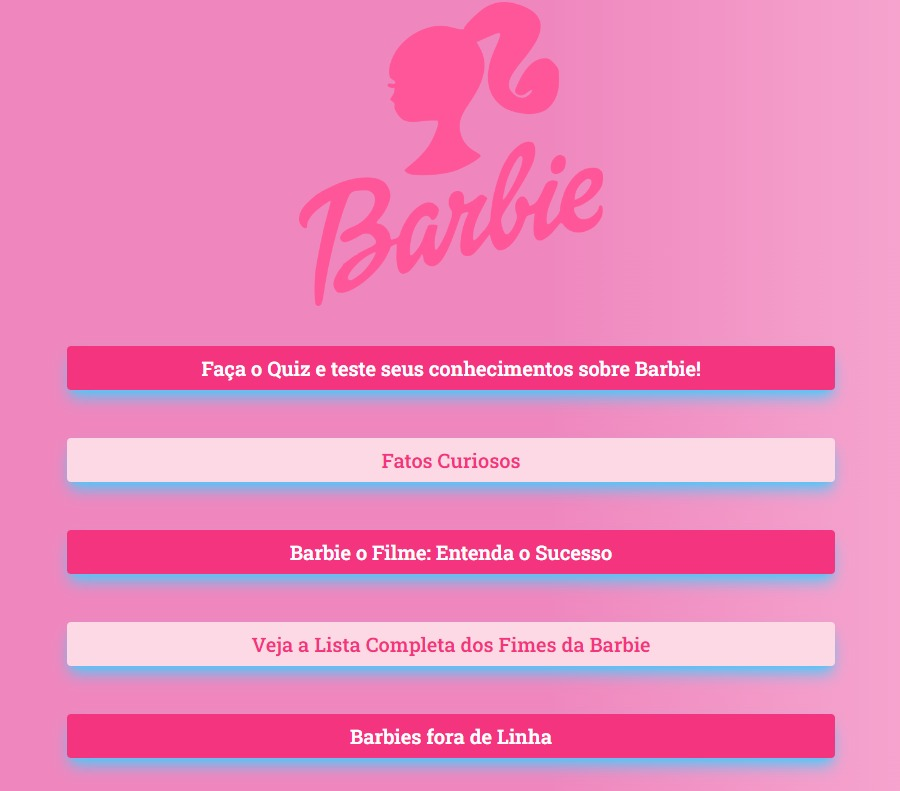

# Barbie page 

Página desenvolvida com objetivo de praticar desenvolvimento Frontend, aproveitei o sucesso dos cinemas e o interesse do público para criar essa página, aproveitando para aprimorar minhas habilidades e adquirir novos conhecimentos. 

As perguntas utilizadas no <a href="https://sabrinapratafernandes.github.io/barbiepage/quiz-barbie">Quiz<a/> e os <a href="https://sabrinapratafernandes.github.io/barbiepage/curiosidades-barbie">Fatos Curiosos<a/> foram gerados pelo <strong>ChatGPT.<strong/>

Este foi meu primeiro projeto desenvolvido utilizando <strong>Tailwind<strong/> após conclusão do curso da Alura.

A análise sobre o sucesso do filme foi feita de forma autoral. 

  

# Conhecimentos aplicados: 
- Manipulação do DOM 
- useState 
- Array e Objetos 
- Acessando Arquivos Data 
- Mobile First com Tailwind

# Criado com: 
- React.js
- Tailwind-css

---

Confira meus <a href="https://github.com/sabrinapratafernandes?tab=repositories">outros projetos<a/> :)

Se chegou até aqui, obrigada!

